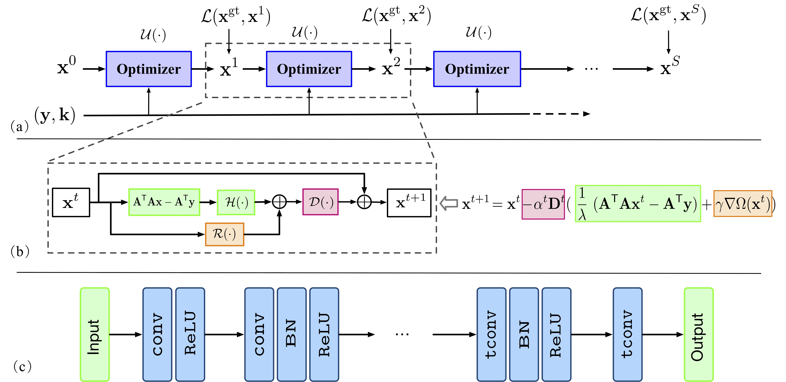
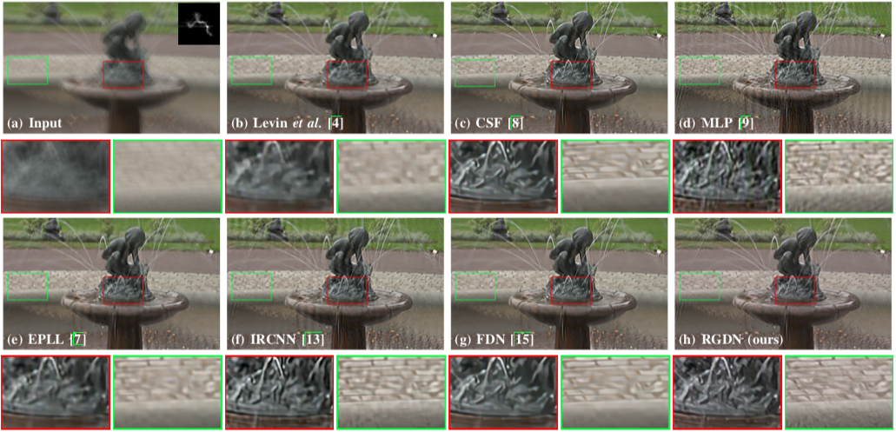

# learn-optimizer-rgdn
<small>Learning Deep Gradient Descent Optimization for Image Deconvolution

Dong Gong*, Zhen Zhang*, Qinfeng Shi, Anton van den Hengel, Chunhua Shen, Yanning Zhang (*Equal contribution)

In IEEE Transactions on Neural Networks and Learning Systems (TNNLS), 2020.

\[[ArXiv](https://arxiv.org/abs/1804.03368)\]
<small>
  
*This implementation is for non-commercial research use only. If you find this code useful in your research, please cite the above paper.*

 

+ Testing script: `./test_entry.py`.
+ Pretrained model: `./rgdn.tr`.
+ [Testing Examples](https://drive.google.com/file/d/1N8s4v0DsDB02vZMH77Z21AejvW2XrjM2/view?usp=sharing), with real and synthetic images. 
+ Kernel generation in Python: `./data/make_kernel.py`, a Python implementation of the kernel simulation method from ["A. Chakrabarti, A neural approach to blind motion deblurring, in ECCV, 2016"](http://arxiv.org/abs/1603.04771).

 

## Requirements
+ Python 3
+ PyTorch 1.1.0 (recommended version)
